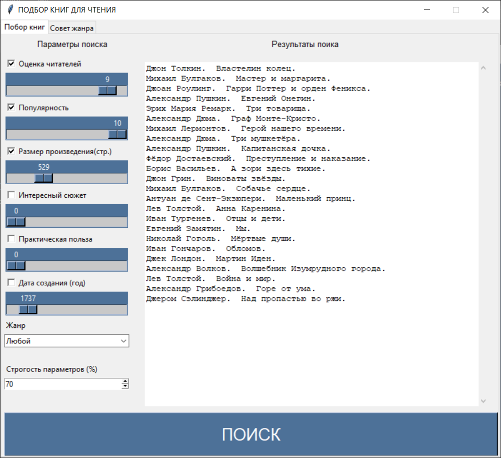

# Проект по математической логике и теории алгоритмов "Подбор книги для пользователя"

**Язык программирования: Python**

**Время разработки: ноябрь-декабрь 2019**

**Базовый алгоритм: нечёткая логика**