# Лабораторная работа №1 (Решение)
###  Выполнил: Миноцкий Ян Анатольевич ББСО-01-18

### suzen1
Используемые команды:
- **ssh** – протокол для удалённого управления компьютером с операционной системой Linux, используется для удаленного управления серверами через терминал
-  **ls** – команда для просмотра содержания директории
- **cat** – чтение данных из файла и вывод их на экран

|  Комбинация клавиш | Действие  |
| :------------: | :------------: |
| Ctrl + Shift + C  |  Копирование |
| Ctrl + Shift + V  |  Вставка |
| Ctrl + D   | Завершение текущего процесса  |
| Ctrl + Alt + T  | Запустить терминал |

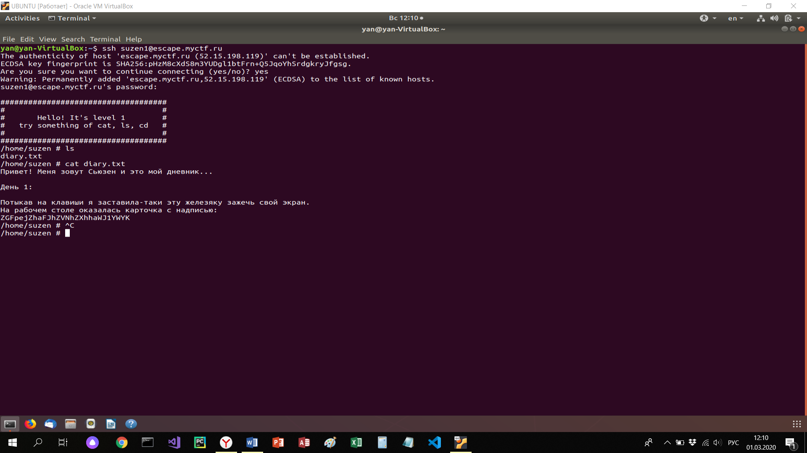
Ключ для следующего таска: ZGFpejZhaFJhZVNhZXhhaWJ1YWYK

------------

### suzen2
Используемые команды:
- **cat \*.txt** - просмотр всех файлов с форматом txt
-  **for i in /home/suzen/*; do cat $i; done;** - bash-скрипт, выводящий содержимое всех файлов в папке

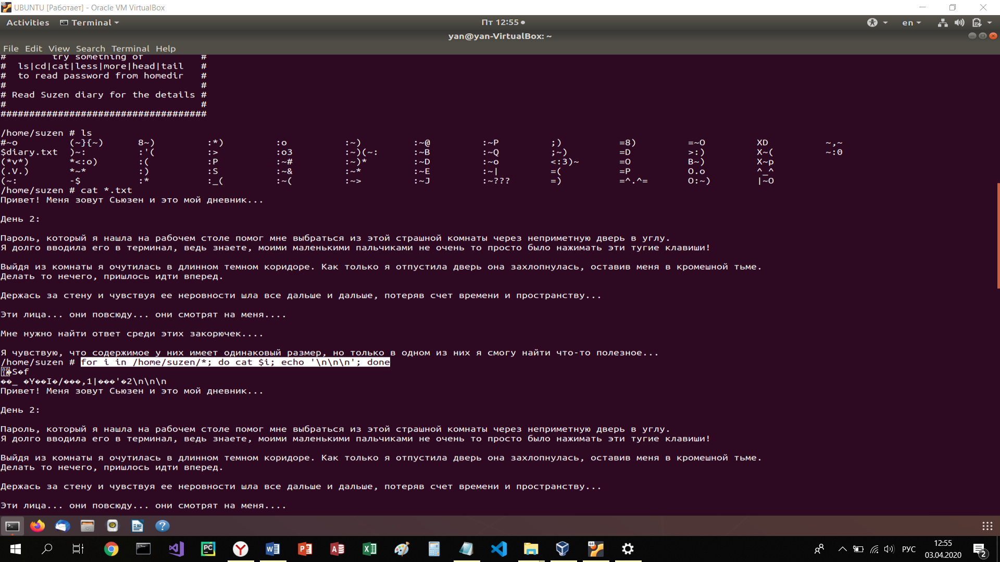
Ключ для следующего таска: dGhlaWxpM2FoWm9odGFpM2VldzMK

------------

### suzen3
Используемые команды:
-  **while read -r l; do echo $l; done <-diary.txt-** - bash-скрипт, построчно читающий файл -diary.txt-

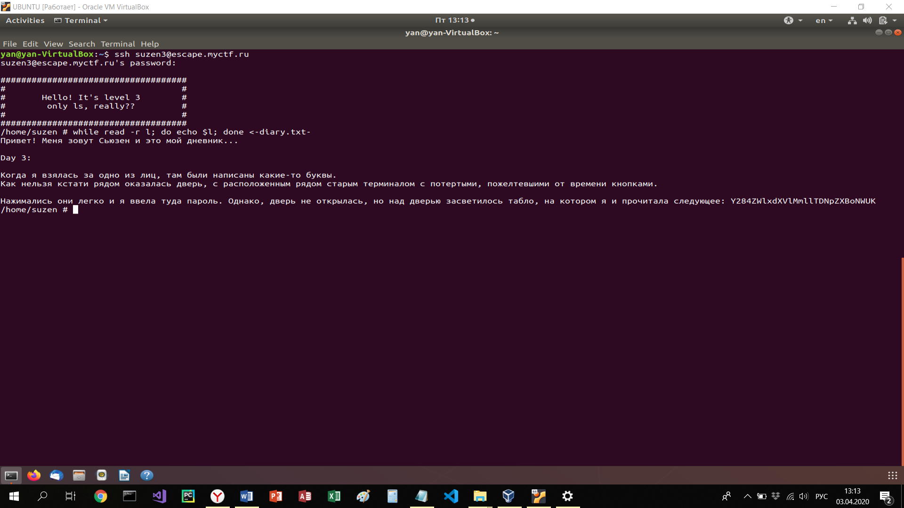
Ключ для следующего таска: Y284ZWlxdXVlMmllTDNpZXBoNWUK

------------

### suzen14
Используемые команды:
- **cd** – переход по директориям
- **clear** – очистка экрана

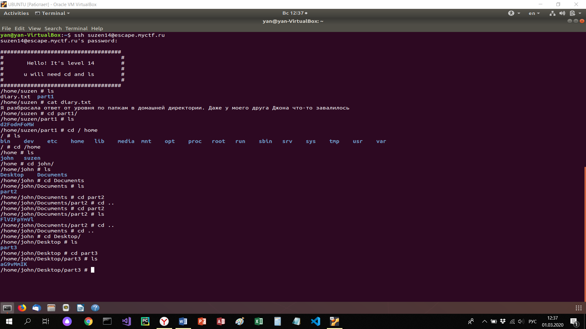
Ключ для следующего таска: d2FodmFoMWFlV2FpYmVlaG9vMmIK

------------

### suzen15
Используемые команды:
- **pwd** – выводит в терминал путь к текущей папке

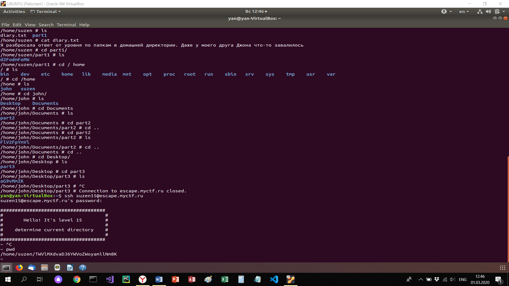
Ключ для следующего таска: TWVlMXdvaDJ6YWVoZWoyamllNm8K

------------

### suzen16
Используемые команды:
- **whoami** – вывод имени пользователя
- **id** – вывод информации об учётной записи текущего пользователя
- **echo** – вывод на экран строки текста

*`$USER` – переменная содержащая сведения о пользователе*

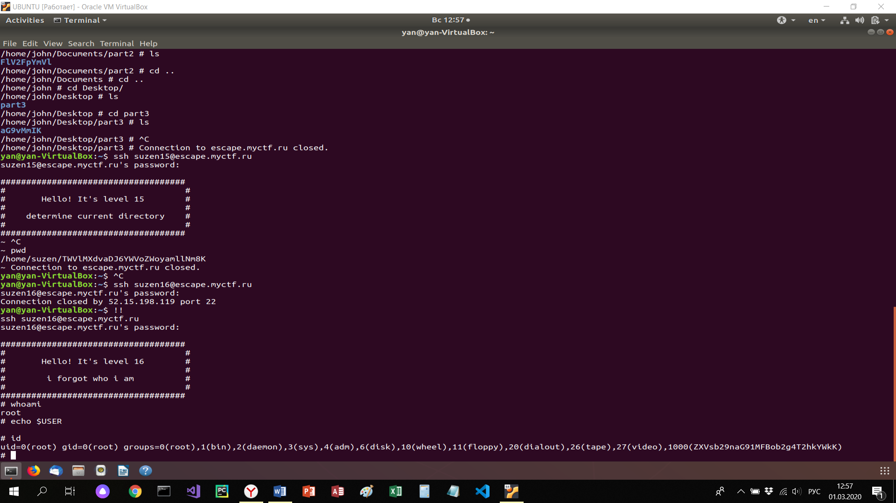
Ключ для следующего таска: ZXVsb29naG91MFBob2g4T2hkYWkK

------------

### suzen17
Используемые команды:
- **ls –a** – показать все файлы, в том числе скрытые

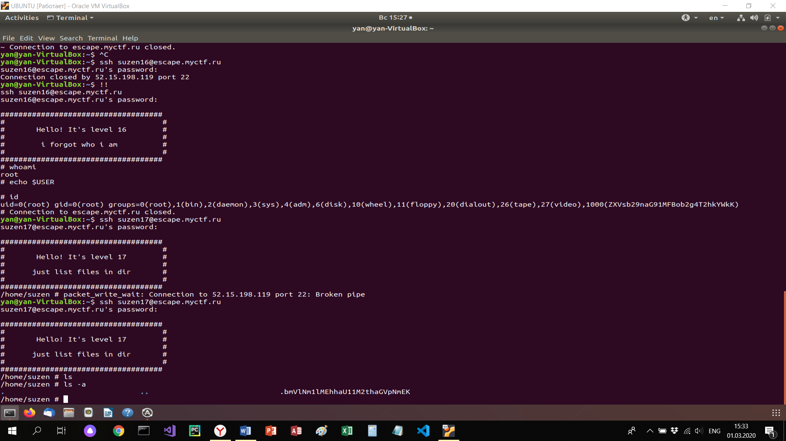
Ключ для следующего таска: bmVlNm1lMEhhaU11M2thaGVpNmEK

------------

### suzen18
Используемые команды:
- **man** – команда для чтения инструкции другой команды

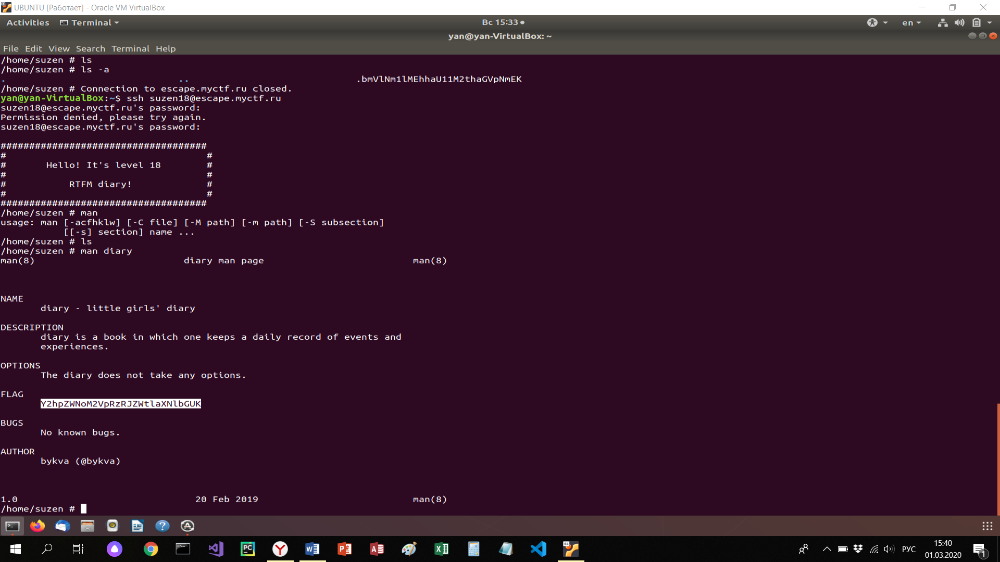
Ключ для следующего таска: Y2hpZWNoM2VpRzRJZWtlaXNlbGUK

------------

### suzen19
Используемые команды:
- **mkdir** – команда для создания нового каталога
  - **-p** - режим для создания подкаталогов в каталоге
  
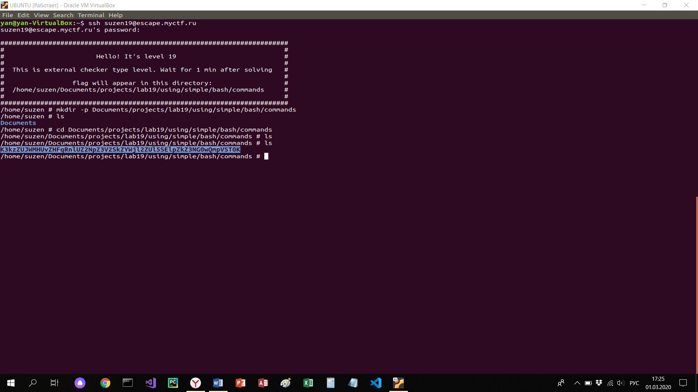
Ключ для следующего таска: K3kzZUJWMHUvZHFqRnlUZ2NpZ3V2SkZYWjl2ZUl5SElpZkZ3NG0wQmpVST0K (не работает)

------------

### suzen20
Используемые команды:
- **rm** – команда для удаления
  - **-rf** - совершить рекурсивный обход всех директорий без выдачи предупреждений
  
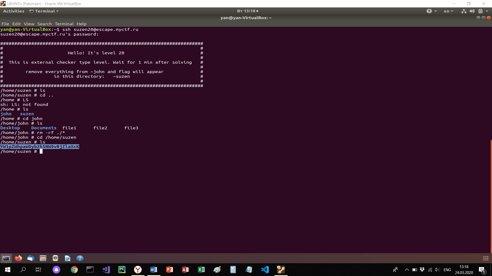
Ключ для следующего таска: YW1pZWhpaW0yb2h5NW9vRjZlaXcK

------------

### suzen21
Используемые команды:
- **touch** - команда для гинерации файлов или для изменения времени последнего взаимодействия с файлом

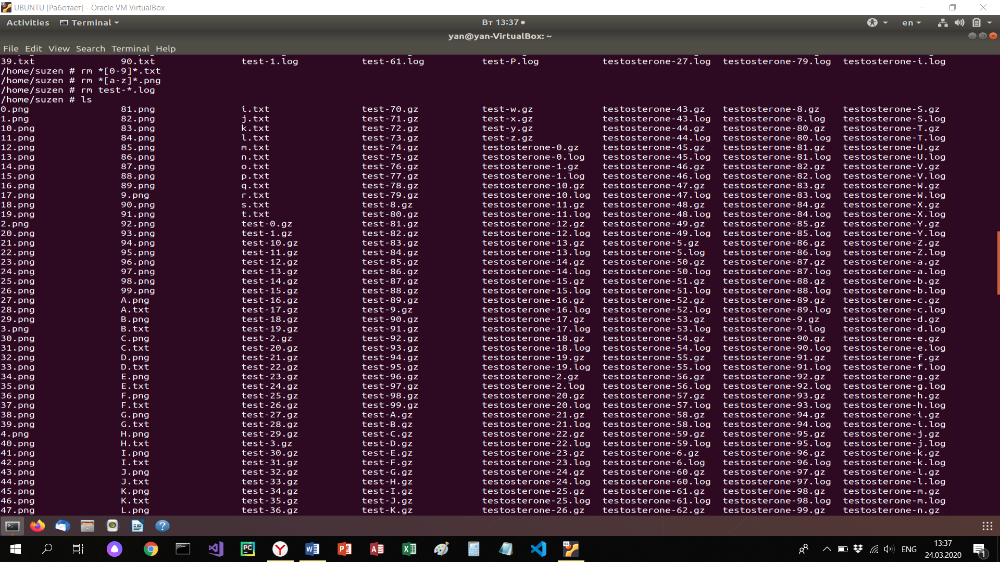
Ключ для следующего таска: aWU0b29XdWxlaXBodXBpZWZveW8K

------------

### suzen22
Не использовал новых команд)

Использовались регулярные выражения:
\* означает любое количество символов на её месте, ? – один любой символ.

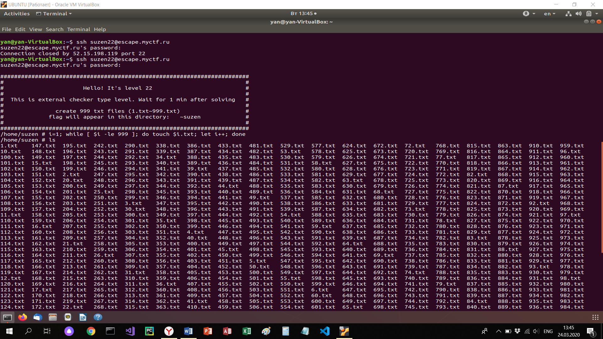
Ключ для следующего таска: dXI2dXNhaDNvaFQxaWV2MGNobzgK

------------

### suzen23
Используемые команды:
- **mv** - перемещение и переименовывание файлов и каталогов

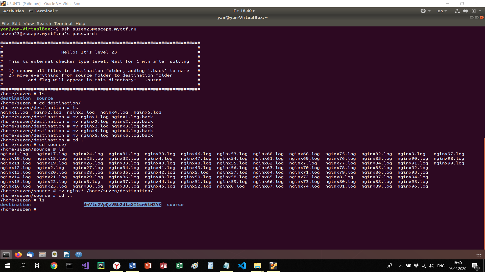
Ключ для следующего таска: 

------------

### suzen24
Используемые команды:
- **cp** - копирование файлов или директорий
  - **-R** - означает включение всех подкаталогов и файлов в них 

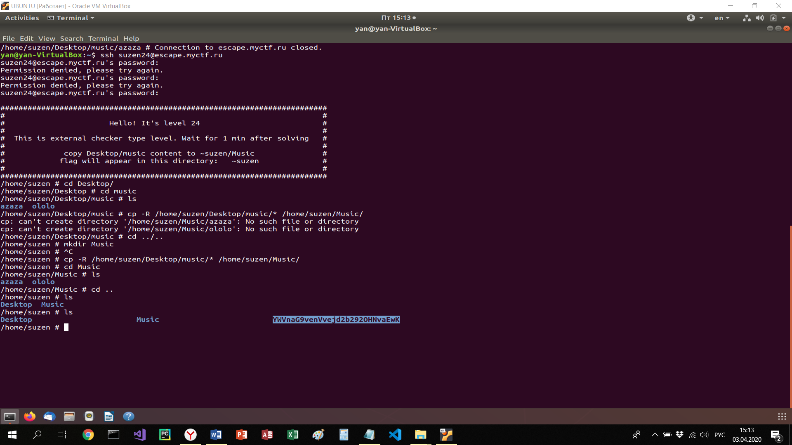
Ключ для следующего таска: YWVnaG9venVvejd2b292OHNvaEwK

------------

### suzen25
Не использовал новые команды)

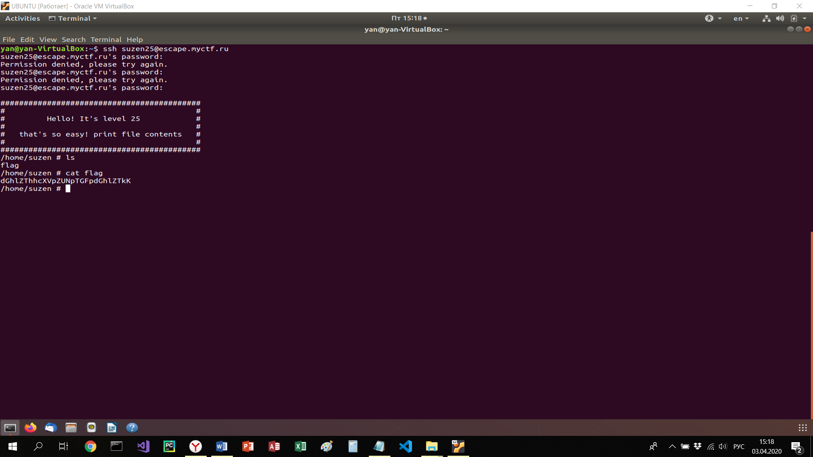
Ключ для следующего таска: dGhlZThhcXVpZUNpTGFpdGhlZTkK

------------

### suzen26
В окне чтения файла, вызванного командой less можно осуществлять поиск с помощью \/

\/FLAG дало результат:
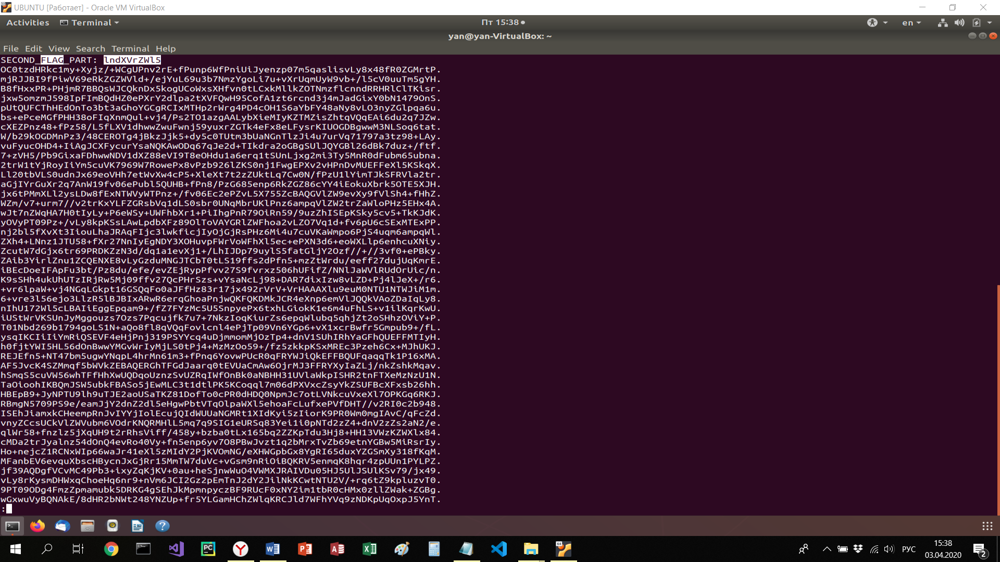

Ключ для следующего таска: WWVpc2gxYWlndXVrZWl5ZWloaWUK

------------

### suzen27
Используемые команды:
- **tail** - просмотр концовки файла
  - **-f** - просматривать непрерывно

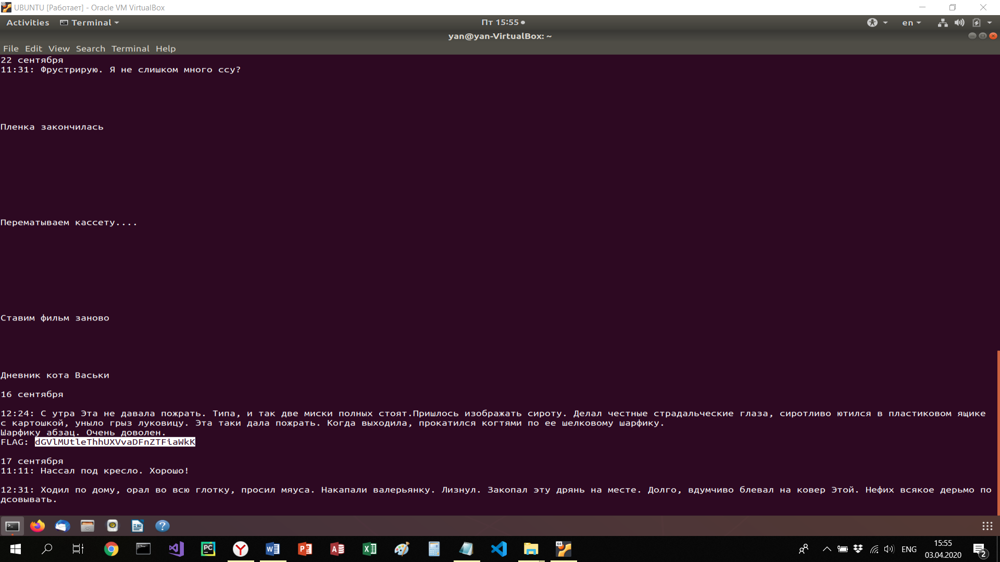
Ключ для следующего таска: dGVlMUtleThhUXVvaDFnZTFiaWkK

------------

### suzen28
Использовал перенаправление ввода в новый содаваемый файл.
- **cat > diary << ENDOFFILE** - с помощью этой строки я могу вставить многострочный текст в создаваемый документ

В конце вводим echo -n "11:32pm: Нассал под кресло. Еееееееее!" >> diary. Тогда всё заработает.

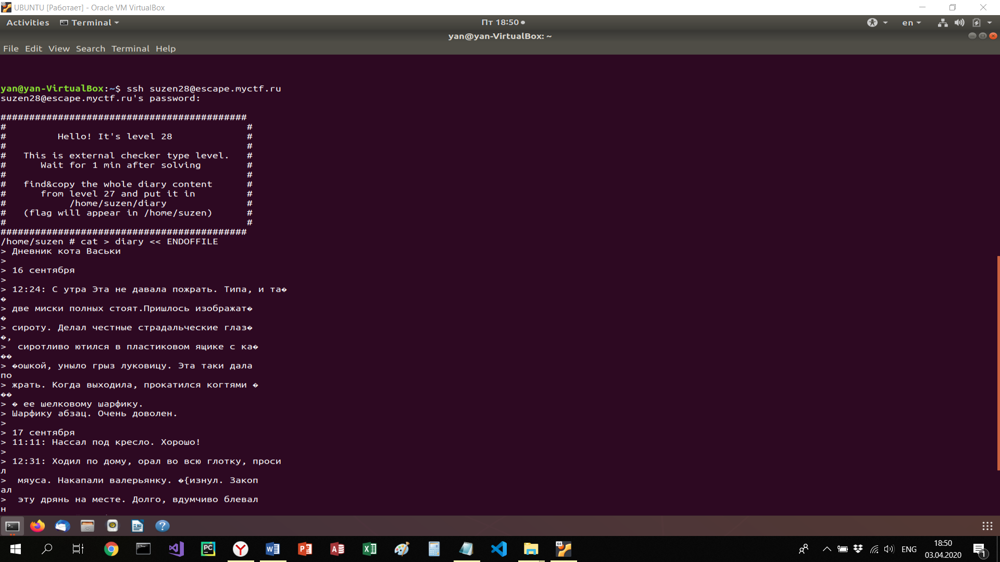
Ключ для следующего таска: ZWV4b1g1WnVkMm9oZnVjYWhkdTMK

------------

### suzen29
Использовал стрелки на клавиатуре для выбора последней используемой команды.

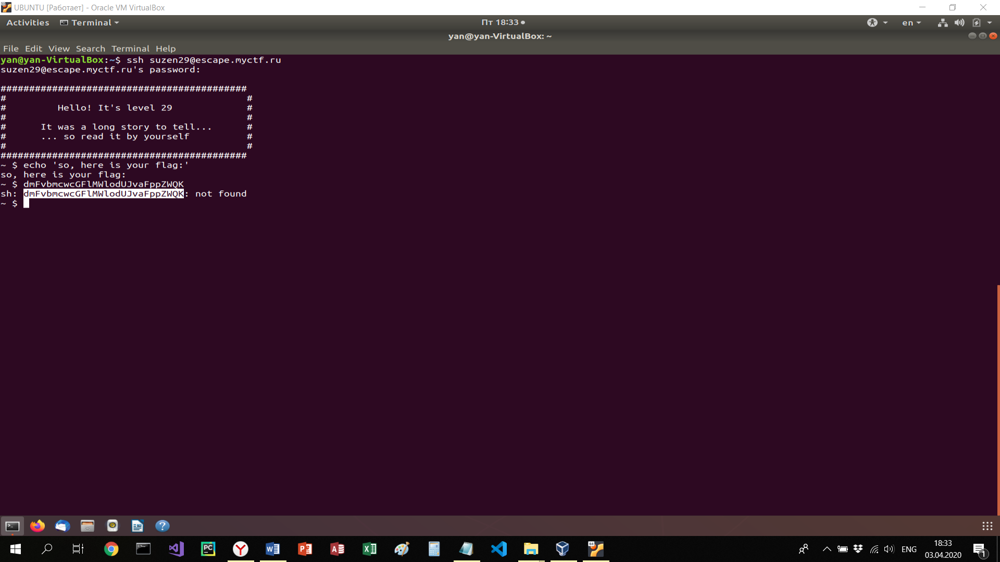
Ключ для следующего таска: dmFvbmcwcGFlMWlodUJvaFppZWQK
