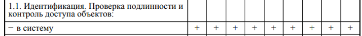
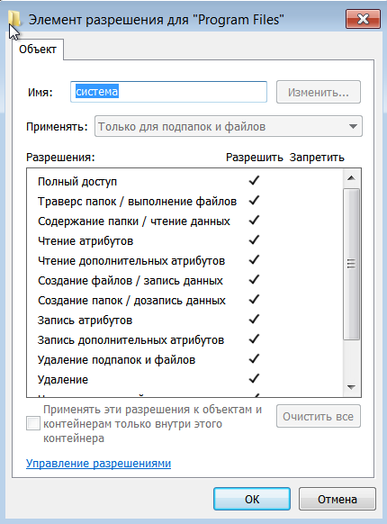

# Практические и контрольные работы по программно-аппаратной защите информации

## Практическая работа №1.

### Задание №1.

Составить программу для определения, 
какое количество информации несет сообщение о том, 
что горит красный и желтый сигнал светофора, 
среднее количество информации о том, 
что загорелся любой из трех сигналов.

[Решение](pract1_task1.py)

### Задание №2

Составить программу, которая кодирует строку любой длины, 
составляет кодовый словарь и выводит закодированное сообщение.

[Решение](pract1_task2.py)

## Контрольная работа №1.

### Задание 1  
Дан двумерный массив n, m. 
Найти индексы всех различных пар элементов сумма которых больше чем 25.

[Решение](test1_task1.py)

### Задание 2  
Дано выражение S = A\*B\*C, A,B,C – заданные целые числа. 
Вместо звёдочек подставить одну из арифметических операций +,-,*, чтобы S= 25. 
Вывести комбинации звёздочек.

[Решение](test1_task2.py)

## Контрольная работа №2

### Задание 1

Рассчитать риски информационной безопасности для одноранговой локальной сети без выхода в Интернет и определить список существенных угроз.

Ценность актива "Сеть" – 4.

Угрозы:

| Идентификатор УБИ | Наименование УБИ | Нарушение конфиденциальности | Нарушение целостности | Нарушение доступности | Степень уязвимости    |  Вероятность   | Риск |
|:-----------------:|:----------------:|:----------------------------:|:---------------------:|:---------------------:|:---:|:---:|:--------:| 
|       22            |      Угроза избыточного выделения оперативной памяти            |  0                            |    0                   |                    1   |  2   |   2  |  16        |
|        34           |  Угроза использования слабостей протоколов сетевого/локального обмена данными                |       1                       |             1          |      1                 |   1  |  2   |    8      |
|       36       |       Угроза исследования механизмов работы  программы       |      1                        |           0            |                    1   |  1   |   2  |   8   |

Риск – 16.

Оценка риска – средняя.

### Задание 2

Определить класс защищенности средств вычислительной техники.

**Программа «Мобильное приложение поиска талантов»**

Описание приложения.

В приложении пользователи могут выкладывать фото или видеоматериалы. Чтобы получить возможность просматривать фото и видео других пользователей и ставить оценки, а также выкладывать свои, пользователи авторизируются в системе. В качестве логина используется электронная почта, которая подтверждается в процессе регистрации. При регистрации указывается имя и фамилия и по желанию пользователя город и данные для связи с организаторами конкурса.




Класс защищённости 2А.

### Задание 3

Составить программу или блок-схему алгоритма, реализующую модель ролевого доступа.

[Решение](test2_task3.py)


## Контрольная работа №3

### Задание 1

Составить программу, при помощи которой зашифровать 
сообщение с помощью алгоритма RSA и проверить его работу. 

[Решение](rca.py)

### Задание 2

Проверить является ли группой множество матриц вида:   
a 0   
0 a ,      
где а - вещественное число не равное нулю относительно умножения.

*Группа — непустое множество, на котором определена ассоциативная бинарная операция, причём для этой операции имеется нейтральный элемент (аналог единицы для умножения), и каждый элемент множества имеет обратный.*


### Задание 3


## Лабораторная работа №1

### 1. Использование прикладной программы OpenStego. 

1.1. Программа предназначена для тайной записи любой информации в рисунки BMP-формата и последующего извлечения этой же информации. «Зашить» можно абсолютно любой файл, в том числе и исполняемый, единственным ограничением является размер файла-контейнера (BMP-файла «Расшить» информацию сможет любой пользователь, у которого есть программа OpenStego или Stegosaurus. Найдите в файл в формате BMP.

1.2. Выделите мышью файл с расширением BMP, кнопка "Зашить" становится доступной. 

1.3. Нажмите кнопку "Зашить", если графический файл был не в 24-битовом формате, то программа предложит его конвертировать – для продолжения работы


необходимо согласится.  

1.4. В открывшемся окне выберите файл-сообщение, который бы Вы хотели спрятать в графический файл. Файл-сообщение может иметь любое расширение. 


Программа предложит уменьшить или увеличить размер BMP-картинки - выбирайте сами.

1.5. В открывшемся диалоговом окне сохраните графический файл-контейнер с "зашитой" информацией


 
### 2. Исследование стойкости архивов с паролями.

С помощью программы WINRAR создать архив текстового файла с паролем из 3-х и 4-х символов.


 
Для подбора пароля воспользуемся утитлитой rar2john  (для получения хеша пароля) и hashcat (преобразование хеша и сравнение с исходным)
2.1.	Извлечем хэш из архива:


 
2.2.	Cохраним этот хэш в файл rar1.hash и произведем подбор пароля по словарю


 
3.2.	Результат:


 
### 3. Исследование стойкости паролей MS Office.


### 4. Методика практической реализации поиска, восстановления и безвозвратного уничтожения конфиденциальных файлов А. Создать на Рабочем столе текстовый файл.


Б. Уничтожить файл с помощью средств ОС.

В. С помощью специальных программ попытаться восстановить файл, открыть восстановленный файл, проверить корректность восстановления файла, подобрать программу, которая правильно восстановит файл, записать результаты со временем восстановления.


 
### 5. Уничтожить файл с помощью специальной программы.


### 6. С помощью специальных программ попытаться восстановить файл, записать результат.
 


### 7. Разработать специальную программу , которая определяет характеристики логического диска, используя АРI-функцию GetVolumelnformation, или информации о материнской платы или другого оборудования.

[Решение](lab1_task7.py)

## Лабораторная работа №2 - Изучение реализации управления доступом средствами ОС

**Описание.**
Изучить возможности разграничения доступа к файлам и папкам в Windows.

Убрав группу Users (Пользователи) из ACL вашего файла, попробуйте открыть его от имени другой учетной записи, не имеющей явных разрешений и не входящей ни в одну из оставшихся в ACL групп (при необходимости создайте такую учетную запись). Если все
сделано правильно, зайдя под подобной учетной записью Вы не получите доступа к файлу.


 
### Задание 1. 
Создать пользователей 3-х классов: владелец файла, пользователь, который принадлежит к группе владельцев файла, все остальные в системе. 
Создать файлы с разными атрибутами: чтение, запись, исполняемый файл. 
Проверить отсутствие или разрешение доступа этих пользователей  к файлу. Проверить возможности доступа через привилегированного пользователя. Задание выполнить в ОС Linux


 
### Задание 2.
Изменить атрибуты файла, запретить запись в файл определённому пользователю. Открыть файл на запись и проверить будет ли к нему доступ если нет прав у данного пользователя. Задание выполнить в ОС Linux
 


### Задание 3.

Создать нового пользователя Windows.


Ознакомиться со [статьей](https://docs.microsoft.com/en-us/previous-versions/windows/it-pro/windows-server-2008-R2-and-2008/cc732880(v=ws.11)?redirectedfrom=MSDN)


Подготовьте ответы на приведенные ниже вопросы.

> Как можно просмотреть набор элементарных разрешений (из которых составлено, например, разрешение «изменить»), имеющихся у пользователя на файл или папку?


 
> Чем составное разрешение «Изменить» (Modify) отличается от разрешения «Полный доступ» (Full Control)?

В «Изменить» (Modify) нельзя удалять подпапки и файлы в них, менять права доступа, менять владельца

> Дает ли разрешение на запись в папку право просматривать ее содержимое? 

Нет


### Задание 4

Посмотрите разрешения на папку Program Files. Опишите в отчете, каким группам какие разрешения даются на эту папку, куда по умолчанию устанавливаются программы.

Владелец папки


 
Права системы


 
Права администраторов такие же

Права пользователей
 


### Задание 5

У объектов файловой системы, таких как файлы, папки и тома, есть владельцы. По умолчанию владельцем объекта становится его создатель. Владелец всегда может изменять разрешения для объекта, даже при отсутствии доступа к нему.
Более подробную информацию по этому поводу можно получить из [справки](https://docs.microsoft.com/en-us/previous-versions/windows/it-pro/windows-server-2008-R2-and-2008/cc732983(v=ws.11)?redirectedfrom=MSDN)

Подготовьте ответы на вопросы.

> Кто может стать новым владельцем объекта (какие разрешения для этого нужны)? 

Нужен полный доступ согласно таблице разрешений в документации

> Как сменить владельца объекта?


 
> Предложите и выполните эксперимент, иллюстрирующий возможности владельца файла, отличающие его от других пользователей.
> 
Мы создали от пользователя Ivan папку, и выставили следующие права для пользователя Petr


 
Тогда Petr может видеть папку и содержимое, но не может изменять её.


### Задание 6

Управлять разрешениями на файлы и папки можно не только
из графического интерфейса Windows, но и из командной строки. Для этого рекомендуется использовать утилиту icacls.exe (также для совместимости поддерживается утилита cacls.exe). 
С возможностями этой утилиты можно ознакомиться по [справке](https://docs.microsoft.com/en-us/previous-versions/windows/it-pro/windows-server-2008-R2-and-2008/cc753525(v=ws.10)?redirectedfrom=MSDN)

С помощью утилиты выполните перечисленные ниже действия.
> сохраните текущий ACL выбранного вами файла в текстовый файл;

```
icacls c:\windows\* /save ACL_файл /T
```

> предоставьте пользователю Student разрешение на изменение данного файла (modify);

```
icacls ACL_файл /grant Student:(M,WDAC)
```
> проверьте работу сделанных настроек;

> восстановите исходный ACL из копии, сделанной в начале выполнения задания.

```
icacls c:\windows\ /restore ACL_файл
```

## Лабораторная работа №3

### Задание 1

Выполните проверку Вашего компьютера с помощью Microsoft Baseline Security analyzer. В отчете о выполнении лабораторной работы укажите:
- как был оценен уровень уязвимости компьютера;
- какие проверки проводились, в какой области обнаружено
наибольшее количество уязвимостей;
- опишите наиболее серьезные уязвимости каждого типа, выявленные на компьютере.


Уровень уязвимости оценен как восклицательный знак, с результатом: «Невозможно загрузить CAB-файл безопасности».
Проверки следующие:
- Проверка на наличие уязвимостей администрирования Windows  
- Проверка слабых паролей  
- Проверка на наличие административных уязвимостей IIS  
- Проверка на наличие административных уязвимостей SQL  
- Проверка наличия обновлений безопасности
  
Как видно из результатов самой серьезной уязвимостью признано отсутствие автоматических обновлений на этом компьютере. Далее есть такие замечания, как простые пароли и пароли без ограничения срока действия, требуемая перезагрузка и наличие двух администраторов.

### Задание 2

Разработать программу для Python для создания цифровой подписи и подтверждение подлинности цифровой подписи.

Общая схема ассиметричного шифрования с защитой от внесения изменений в данные.


* [Программа для генерации ключей.](keygen.py) Был использован алгоритм RSA.
* В результате получаем [приватный](private_key.pem) и [публичный](public_key.pem) ключ.
* [Программа для подписывания файла.](sign.py) На вход подаётся путь к файлу и путь к приватному ключу.
* [Шифрование файла](encript.py)
* [Расшифровка файла](decript.py)
* [Программа для проверки подписанного файла.](verify.py)

### Задача №3 

Подобрать строку d1, у которой hash(d1) содержит первые 4 байта нулевые.

[Решение](lab3_task3.py)
