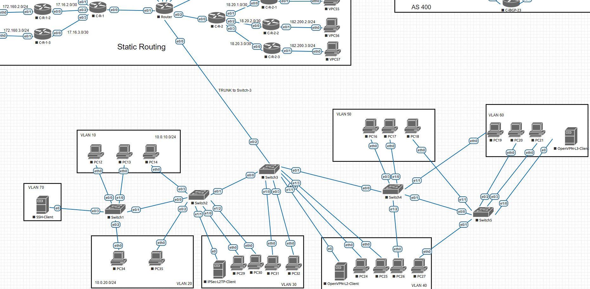
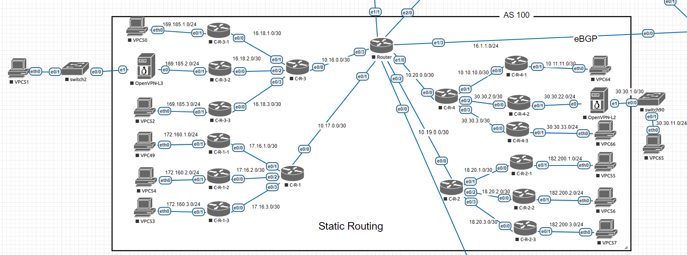
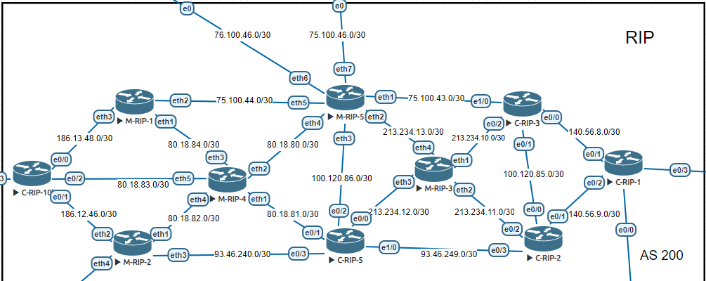
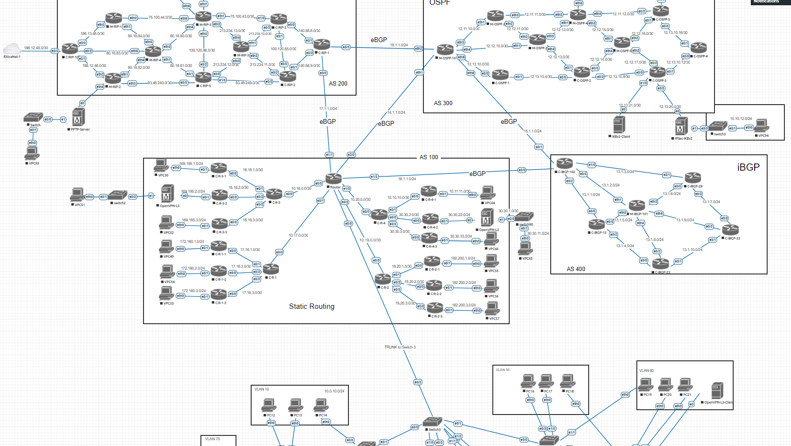
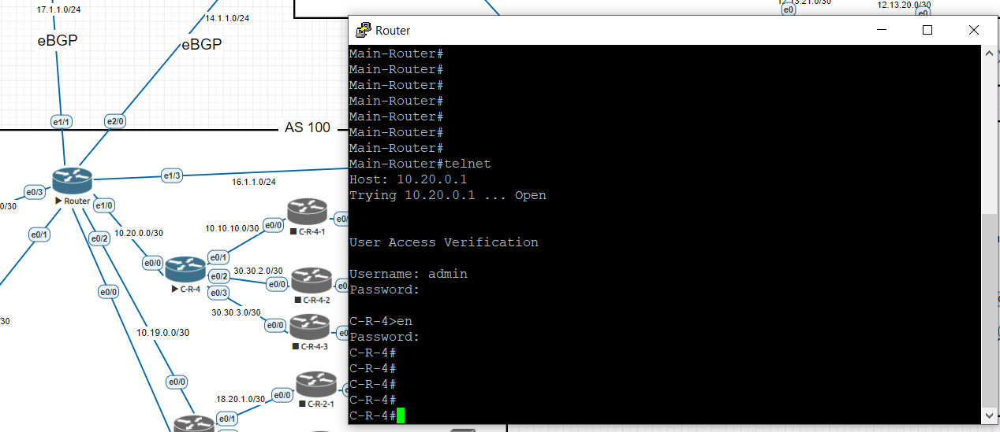

# Лабораторные работы по дисциплине "Сети и системы передачи данных"
## [Задания и инструкции по выполнению лабораторных работ](https://hackmd.io/@sadykovildar/B16xYzRmw)

## [Полезные видеоуроки по сетевому администрированию](https://www.youtube.com/watch?v=Y4l8ScRLrf4&list=PLtPJ9lKvJ4oh_w4_jtRnKE11aqeRldCFI)

## Лабораторная работа №1  - VLAN, DHCP

> **Коммутатор** — устройство, предназначенное для соединения нескольких узлов компьютерной сети в пределах одного или нескольких сегментов сети. Коммутатор работает на канальном уровне модели OSI.

> **Маршрутизатор** — специализированное устройство, которое пересылает пакеты между различными сегментами сети на основе правил и таблиц маршрутизации.

Настройка интерфейсов:
    
    en
    conf t
    hostname C-R-2

    conf t
    int e0/0
    description "to switch3"
    no shutdown

Switch1

    interface Ethernet0/0
     description PC12
     switchport access vlan 10
     switchport mode access
    !
    interface Ethernet0/1
     description Switch2
     switchport trunk encapsulation dot1q
     switchport mode trunk
    !
    interface Ethernet0/2
     description PC34
     switchport access vlan 20
     switchport mode access
    !
    interface Ethernet0/3
     description SSH-client
     switchport access vlan 70
     switchport mode access
    !
    interface Ethernet1/0
     description PC13
     switchport access vlan 10
     switchport mode access
    !

Main Router
    
    ip dhcp excluded-address 10.0.10.200 10.0.10.254
    ip dhcp excluded-address 10.0.20.200 10.0.20.254
    ip dhcp excluded-address 10.0.30.200 10.0.30.254
    ip dhcp excluded-address 10.0.40.200 10.0.40.254
    ip dhcp excluded-address 10.0.50.200 10.0.50.254
    ip dhcp excluded-address 10.0.60.200 10.0.60.254
    !
    ip dhcp pool vlan-10
     network 10.0.10.0 255.255.255.0
     default-router 10.0.10.254
     domain-name vlan-10.yan.ru
     dns-server 8.8.8.8
    !
    ip dhcp pool vlan-20
     network 10.0.20.0 255.255.255.0
     default-router 10.0.20.254
     domain-name vlan-20.yan.ru
     dns-server 8.8.8.8
    !
    ip dhcp pool vlan-30
     network 10.0.30.0 255.255.255.0
     default-router 10.0.30.254
     domain-name vlan-30.yan.ru
     dns-server 8.8.8.8
    !
    ip dhcp pool vlan-40
     network 10.0.40.0 255.255.255.0
     default-router 10.0.40.254
     domain-name vlan-40.yan.ru
     dns-server 8.8.8.8
    !
    ip dhcp pool vlan-50
     network 10.0.50.0 255.255.255.0
     default-router 10.0.50.254
     domain-name vlan-50.yan.ru
     dns-server 8.8.8.8
    !
    ip dhcp pool vlan-60
     network 10.0.60.0 255.255.255.0
     default-router 10.0.60.254
     domain-name vlan-60.yan.ru
     dns-server 8.8.8.8

    interface Ethernet0/0.10
     description vlan-10
     encapsulation dot1Q 10
     ip address 10.0.10.254 255.255.255.0
    !
    interface Ethernet0/0.20
     description vlan-20
     encapsulation dot1Q 20
     ip address 10.0.20.254 255.255.255.0
    !
    interface Ethernet0/0.30
     description vlan-30
     encapsulation dot1Q 30
     ip address 10.0.30.254 255.255.255.0
    !
    interface Ethernet0/0.40
     description vlan-40
     encapsulation dot1Q 40
     ip address 10.0.40.254 255.255.255.0
    !
    interface Ethernet0/0.50
     description vlan-50
     encapsulation dot1Q 50
     ip address 10.0.50.254 255.255.255.0
    !
    interface Ethernet0/0.60
     description vlan-60
     encapsulation dot1Q 60
     ip address 10.0.60.254 255.255.255.0
    !
    interface Ethernet0/0.70
     description MGMT
     encapsulation dot1Q 70
     ip address 10.0.70.254 255.255.255.0
    !

ip dhcp - для проверки подключения компьютеров в первой лабораторной

Полезные команды:
sh ip route - показать известные маршруты

ip route print - для Mikrotik

ping + ip-адрес - отправить тестовые пакеты (проверка передачи данных по каналу)

sh run - просмотр конфигурации на Cisco

export - просмотр конфигурации на Mikrotik

trace + ip-адрес или traceroute + ip-адрес - трассировка на Cisco
Ctrl + Shift + 6 - завершить трассировку

tool traceroute + ip-адрес - трассировка на Mikrotik

## Лабораторная работа №2  - Статическая маршрутизация
    ip route <distanation ip> <mask> <gateway>

C-R-4

    ip route 0.0.0.0 0.0.0.0 10.20.0.2
    ip route 10.0.0.0 255.255.0.0 10.20.0.2
    ip route 10.11.11.0 255.255.255.252 10.10.10.1
    ip route 10.16.0.0 255.255.255.252 10.20.0.2
    ip route 10.17.0.0 255.255.255.252 10.20.0.2
    ip route 10.19.0.0 255.255.255.252 10.20.0.2
    ip route 16.18.0.0 255.255.252.0 10.20.0.2
    ip route 17.16.0.0 255.255.252.0 10.20.0.2
    ip route 18.20.0.0 255.255.252.0 10.20.0.2
    ip route 30.30.22.0 255.255.255.0 30.30.2.1
    ip route 30.30.33.0 255.255.255.0 30.30.3.1
    ip route 169.185.0.0 255.255.252.0 10.20.0.2
    ip route 172.160.0.0 255.255.255.0 10.20.0.2
    ip route 182.200.0.0 255.255.252.0 10.20.0.2

## Лабораторная работа №3  - Динамическая маршрутизация. Протоколы RIP и OSPF

### RIP на Cisco
    router rip
    version 2
    redistribute connected
    network 75.0.0.0
    network 100.0.0.0
    network 140.56.0.0
    network 213.234.10.0

### RIP на Mikrotik
    /routing rip
    set redistribute-connected=yes
    /routing rip network
    add network=213.234.10.0/30
    add network=213.234.11.0/30
    add network=213.234.12.0/30
    add network=213.234.13.0/30

### OSPF на Cisco
    router ospf 1
    redistribute connected subnets
    network 12.12.13.0 0.0.0.3 area 0
    network 12.12.14.0 0.0.0.3 area 0
    network 12.13.10.4 0.0.0.3 area 0
    network 12.13.10.8 0.0.0.3 area 0

### OSPF на Mikrotik
    /interface bridge
    add name=loopback
    /routing ospf instance
    set [ find default=yes ] router-id=10.255.255.5
    /routing ospf network
    add area=backbone network=12.12.15.0/30
    add area=backbone network=12.12.16.0/30
    add area=backbone network=12.12.17.0/30
    add area=backbone network=12.12.14.0/30

## Лабораторная работа №4  - Динамическая маршрутизация. Протокол BGP

    router bgp 400
    bgp log-neighbor-changes
    network 13.1.1.0 mask 255.255.255.0
    network 13.1.2.0 mask 255.255.255.0
    network 13.1.3.0 mask 255.255.255.0
    network 15.1.1.0 mask 255.255.255.0
    network 16.1.1.0 mask 255.255.255.0
    redistribute connected
    neighbor 13.1.1.15 remote-as 400
    neighbor 13.1.1.15 route-reflector-client
    neighbor 13.1.1.15 next-hop-self
    neighbor 13.1.2.101 remote-as 400
    neighbor 13.1.2.101 route-reflector-client
    neighbor 13.1.2.101 next-hop-self
    neighbor 13.1.3.28 remote-as 400
    neighbor 13.1.3.28 route-reflector-client
    neighbor 13.1.3.28 next-hop-self
    neighbor 15.1.1.10 remote-as 300
    neighbor 16.1.1.100 remote-as 100

    /interface bridge
    add name=loopback
    /routing bgp instance
    add as=400 name=BGP400 redistribute-connected=yes router-id=10.255.255.102
    /ip address
    add address=10.255.255.102 interface=loopback network=10.255.255.102
    /routing bgp peer
    add instance=BGP400 name=peer1 nexthop-choice=force-self remote-address=\
    13.1.2.102 remote-as=400 route-reflect=yes
    add instance=BGP400 name=peer2 nexthop-choice=force-self remote-address=\
    13.1.5.15 remote-as=400 route-reflect=yes
    add instance=BGP400 name=peer3 nexthop-choice=force-self remote-address=\
    13.1.8.23 remote-as=400 route-reflect=yes
    add instance=BGP400 name=peer4 nexthop-choice=force-self remote-address=\
    13.1.9.33 remote-as=400 route-reflect=yes
    add instance=BGP400 name=peer5 nexthop-choice=force-self remote-address=\
    13.1.6.28 remote-as=400 route-reflect=yes

## Лабораторная работа №5  - SSH, NAT
    en
    conf t
    ip ssh version 2
    ip domain name <domain>
    crypto key generate rsa
    service password-encryption
    username <username> privilege <0-15> password <password>
    aaa new-model
    line vty 0 4
    transport input all
    logging synchronous
    exec-timeout 60 0
    exit
    enable password <password>
    do wr

    interface Ethernet0/0
     description "M-RIP-1"
     ip address 186.13.48.2 255.255.255.252
     ip nat enable
    !
    interface Ethernet0/1
     description "M-RIP-2"
     ip address 186.12.46.2 255.255.255.252
     ip nat enable
    !
    interface Ethernet0/2
     description "C-RIP-7"
     ip address 80.18.83.2 255.255.255.252
     ip nat enable
    !
    interface Ethernet0/3
     description "ExtraNet-1"
     ip address dhcp
     ip nat enable
    !

Подключение по ssh и telnet:

    ssh -l <username> <ip>

    system ssh address=<ip> user=<username>
    system telnet address=<ip> user=<username>

